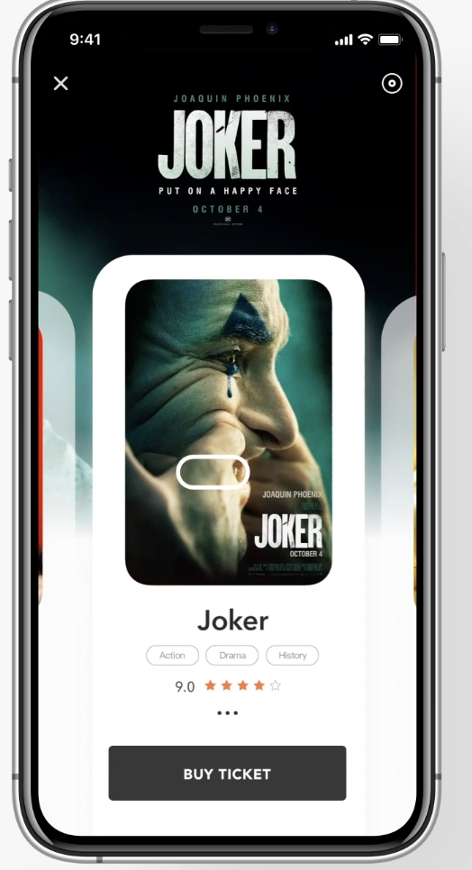
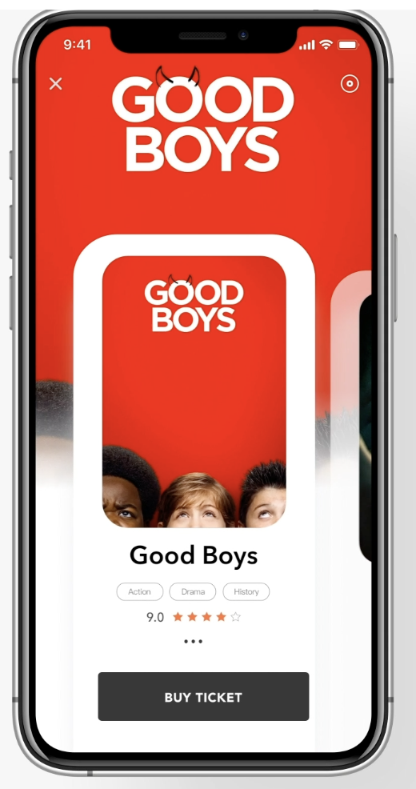
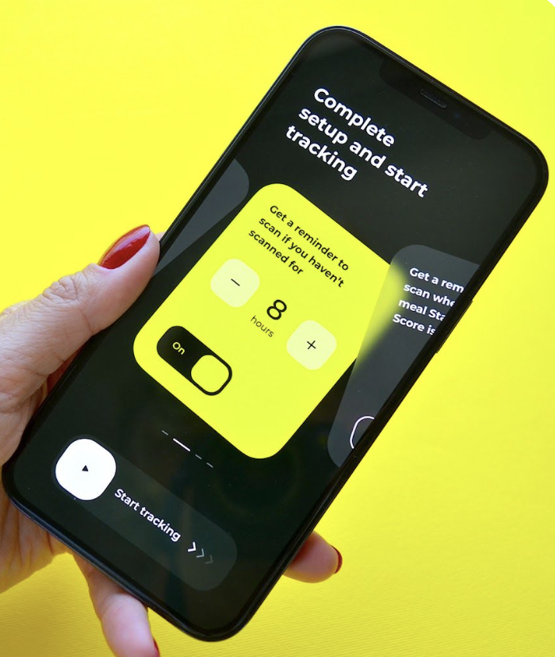

# Project Requirements: SocialDeck AI (MVP)

## 1. Project Overview
**SocialDeck AI** is a mobile party game application that serves as a "digital party kit." It consolidates multiple social game types (Trivia, Charades, Truth or Dare, etc.) into a single app. 

The core value proposition is the **"Bookshelf Strategy"**:
1.  **Stable Engines:** Hard-coded UI templates for specific game mechanics.
2.  **Infinite Content:** Content is delivered via "Decks." The app ships with offline "Seed Decks" and allows users to generate custom "Gen Decks" using the Google Gemini API.

---

## 2. User Flow (The "Bookshelf" Model)

1.  **Splash Screen:** Logo -> Background Asset Loading.
2.  **Dashboard (Home):** Carousel view that swipe, a button at the top to switch from carousel to Grid layout with large, colorful distinct cards for game modes. and vise versa, each carousel has its own distinct color backround that matches its card example [ TRIVIA ] [ CHARADES ] [ **TRUTH OR DARE** ] [ DEBATE .
3.  **Deck Library:** Upon selecting a Mode, user sees a bottom modal that animates up showing list of available Decks:
    *   *System Decks* (Pre-installed, Read-only).
    *   *User Decks* (Created via AI, stored locally).
    *   When user clicks on any deck, it takes them to the Game loop page.
    *   *Create ne Button (+)*: Triggers the AI Generator .
4.  **Game Configuration:** Simple toggle for Timer/Sound -> "Start Game".
5.  **Game Loop:** The active gameplay screen based on the selected Mode's Engine.
6.  **Summary/Results:** End of deck statistics -> Options to [Replay], [Remix], or [Exit].

---

## 3. Functional Requirements

### 3.1. Core Architecture
*   **Engine-Content Separation:** The app must treat content (text/questions) as data payloads (JSON) that feed into reusable UI wrappers (Engines).
*   **Offline First:** The app must function 100% offline using System Decks. Internet is only required to generate *new* decks.

### 3.2. Game Engines (MVP)
The app must support the following 4 UI Engines:

1.  **The Quiz Engine** (Target: Trivia)
    *   **UI:** Question Text, 4 Option Buttons, Timer Bar.
    *   **Logic:** Detect tap, validate correct index, update score, auto-advance on timer expiry.
2.  **The Flip Engine** (Target: Truth or Dare, Never Have I Ever, Paranoia)
    *   **UI:** Card Front (Category/Prompt), Card Back (Details/Punishment).
    *   **Logic:** Tap to flip, swipe to next.
3.  **The Task Engine** (Target: Charades, Taboo)
    *   **UI:** Big Text (Target Word), Subtext (Forbidden words/Rules), Timer.
    *   **Logic:** Gyroscope tilt (Pass/Success) OR Button press (Got it/Skip).
4.  **The Voting Engine** (Target: Most Likely To)
    *   **UI:** Statement Text, Count-in Timer (3-2-1).
    *   **Logic:** Auto-advance after delay.

### 3.3. AI Content Generation (Gemini API)
*   **Generator Dialog:** A modal allowing input of a `Topic` (String) and `Vibe` (Optional String).
*   **API Interaction:** Send prompt to Gemini Flash 1.5 requesting structured JSON.
*   **Validation:** App must validate JSON schema before accepting.
*   **Persistence:** Generated JSON is parsed into a `GameDeck` object and saved to Local DB (Hive/Isar).

### 3.4. Deck Management
*   **Listing:** Show System Decks (bundled in assets) mixed with User Decks (from DB).
*   **Deleting:** Users can delete User Decks (but not System Decks).
*   **Remixing:** A "Remix" button on any deck sends the current deck's metadata to Gemini to generate a *variation* or *sequel* deck.

---

## 4. Non-Functional Requirements

### 4.1. Performance & UX
*   **Generation Latency:** AI generation must handle 2-5 second delays gracefully with a "Mixing Cards" animation.
*   **Startup Time:** App must load to Dashboard in < 2 seconds.
*   **Visuals:** Dark Mode default (optimized for low-light party environments). Large, high-contrast typography.

### 4.2. Reliability
*   **Error Handling:** If Gemini API fails (timeout/hallucination), show a friendly toast ("The bartender dropped the cards. Try again.") and do not crash.
*   **Data Integrity:** Saved decks must persist across app restarts.

---

## 5. Technical Stack

*   **Framework:** Flutter (Dart).
*   **State Management:** Riverpod.
*   **Local Database:** Hive (for storing User Decks JSON) or Isar.
*   **AI Provider:** `google_generative_ai` SDK (Gemini 1.5 Flash).
*   **Navigation:** Use just Navigator 1.0.
*   **Assets:** JSON files stored in `assets/decks/` for offline content.

---

## 6. Data Schema (Reference)

**Deck Object:**
```json
{
  "id": "uuid_v4",
  "title": "90s Hip Hop",
  "game_engine_id": "quiz",
  "is_system": false,
  "created_at": "timestamp",
  "cards": [ ... ]
}
```

**Card Object (Polymorphic):**
```json
{
  "content": "Who released Illmatic?",
  "options": ["Nas", "Jay-Z", "Biggie", "Tupac"],
  "correct_index": 0,
  "meta": { "timer": 15, "forfeit": "Take 1 sip" }
}
```

---

## 7. UI Prototypes & References

*This section contains reference images for the UI layout.*

### 7.1. Dashboard (Home)
*Carousel view that swipe, a button at the top to switch from carousel to Grid layout with large, colorful distinct cards for game modes. and vise versa, each carousel has its own distinct color backround example [ TRIVIA ] [ CHARADES ] [ **TRUTH OR DARE** ] [ DEBATE ]*
 
 

### 7.2. Deck Library
* Bottom modal of Vertical list. System decks have lock and user decks have a nothing. Button bottom to create new. Tap on the deck opens it*


### 7.3. Game Screen (Quiz Engine)
*Timer at top. Question in middle. 2x2 Grid of answers at bottom.*


### 7.4. Game Screen (Flip Engine)
*Minimalist card in center. Tap to reveal animation.*


---

## 8. Other requirements
### 8.0. Theming
- The app uses dark mode only
- Theming should be done by setting the `theme` in the `MaterialApp`rather than hard coding in the widgets themselves

### 8.1 Coding style
- Ensure proper seperation of concerns by creating a suitable folder structure
- prefer small composable widgets over large ones
- prefer standard widget classes over widget functions
- Use `log`from `dart:developer`rather than `print` or `debugPrint`or logging